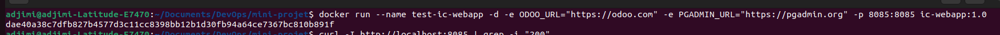
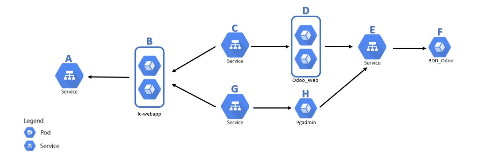

# PROJET FINAL DEVOPS


## **1) Partie 1 : Introduction**

La société IC GROUP dans laquelle vous travaillez en tant qu’ingénieur Devops souhaite mettre sur pied un site web vitrine devant permettre d’accéder à ses 02 applications phares qui sont :

1. Odoo et
2. pgAdmin
Odoo, un ERP multi usage qui permet de gérer les ventes, les achats, la comptabilité, l’inventaire, le personnel …

Odoo est distribué en version communautaire et Enterprise. ICGROUP souhaite avoir la main sur le code et apporter ses propres modifications et customisations ainsi elle a opté pour l’édition communautaire. Plusieurs versions de Odoo sont disponibles et celle retenue est la 13.0 car elle intègre un système de LMS (Learning Management System) qui sera utilisé pour publier les formations en internes et ainsi diffuser plus facilement l’information.

Liens utiles :

- Site officiel : https://www.odoo.com/
- GitHub officiel: https://github.com/odoo/odoo.git
- Docker Hub officiel : https://hub.docker.com/_/odoo

pgAdmin quant à elle devra être utilisée pour administrer de façon graphique la base de données PostgreSQL crée précédemment.

- Site officiel : https://www.pgadmin.org/
- Docker Hub officiel: https://hub.docker.com/r/dpage/pgadmin4/


## **1)  Conteneurisation de l’application web**

### **a)  Création de l'image et du container de test**

Après avoir rédigé le Dockerfile, nous allons builder l'image et créer le conteneur de test. Pour ce faire, nous allons exécuter les commandes suivantes :

```bash
docker build -t ic-webapp:1.0 .
docker run --name test-ic-webapp -d -e ODOO_URL="https://odoo.com" -e PGADMIN_URL="https://pgadmin.org" -p 8080:8080 ic-webapp:1.0

ic-webapp:1.0 
```



### **b) Suppression du container de test et pousse de l'image dans notre compte Docker Hub**

Pour supprimer le conteneur de test, nous allons exécuter les commandes ci-dessous.

```bash
docker s#top test-ic-webapp
docker rm test-ic-webapp
```
Ensuite, nous allons taguer l'image et nous connecter à notre compte Docker Hub avec les commandes suivantes :

```bash
docker tag ic-webapp:1.0 lionie/ic-webapp:1.0
docker login
```
Il nous sera demandé de fournir nos informations de connexion (nom d'utilisateur et mot de passe). Une fois connectés, nous taperons la commande suivante pour pousser l'image :

```bash
docker push lionie/ic-webapp:1.0
```

Ainsi prend fin cette partie. Dans la partie suivante il sera question de mettre en place un pipeline CI/CD à l'aide de Jenkins et Ansible


## **2) Partie 2 : Mise en place d'un pipeline CI/CD à l'aide de JENKINS et de ANSIBLE.**

 ### **a) PRésentation des serveurs**

 Pour réaliser cette partie, nous avons utiliser Vagrant pour provisionner 3 Machines Virtuelles comme suit: 

 - 1 Machine Virtuelle où nous avons installé Jenkins et Ansible;
 - 1 Machine Virtuelle où sera déployé PgAdmin et l'application vitrine ic-webapp;
 - 1 Machine Virtuelle où sera déployer l'application Odoo.

 

 ### **b) Automatisation du déploiement**

 Pour ce faire, nous avons créé des rôles Ansible pour les applications PgAdmin, Odoo et ic-webapp, ainsi qu'un fichier Jenkinsfile contenant les différentes étapes de notre pipeline. Nous avons utilisé Ansible dans le pipeline Jenkins pour exécuter les différents playbooks.


 ### **c) Tests de fonctionnement**

 - Lancement manuel du pipeline

Pour ce faire, nous avons accéder à l'interface graphique de Jenkins en tapant l'URL http://192.168.56.10:8080/ dans le navigateur, puis sélectionner notre pipeline en cliquant sur son nom (dans notre cas ic-webapp), et enfin cliquer sur "Lancer un build".

Version de l'image Docker buildée lors du déploiement manuel:
  
  

  - lancement automatiquement du pipeline

  Nous avons utiliser ngrok pour rendre Jenkins accessible à l'extérieur de notre réseau local. Ngrok nous a fourni une URL publique permettant d'accéder à Jenkins depuis l'extérieur.

  

  Nous avons utilisé cette URL pour configurer un webhook qui permettant une intégration continue automatisée entre GitHub et Jenkins. Autrement dit, à chaque fois qu'un push sera effectué sur notre dépôt GitHub, un build sera lancé dans Jenkins, rendant ainsi l'exécution du pipeline automatique.

  

  - Version buildée lors du déploiement automatique :

  

  - Pour accéder à l'application vitrine ic-webapp nus avons entrez dans le navigateur l'URL suivante : http://192.168.56.11:8000/

  

  - Une fois sur l'application vitrine, en cliquant sur l'image Odoo, nous sommes redirigés vers l'application Odoo.

  
  
  

  - Une fois sur l'application vitrine, en cliquant sur l'image PgAdmin, nous sommes redirigés vers l'application PgAdmin.

  
  

Cette partie est maintenant terminée. Dans la prochaine partie, nous déploierons les applications citées dans un cluster Kubernetes.


## **3) Partie 3 : Déploiement des différentes applications dans un cluster Kubernetes**

### **a) Architecture**



En nous basant sur cette architecture logicielle, nous allons donner le type et le rôle de chacune des ressources (A…H) mentionnées dans cette architecture.

A : Service ic-webapp

  - Type : NodePort

  - Rôle : permet d'accéder à l'application web ic-webapp.

B : ic-webapp

  - Type: Pod

  - Rôle: exécute l'application ic-webapp et répond aux requêtes HTTP envoyées via le service (A).

C : Service  Odoo

  - Type : Service NodePort 

  - Rôle  : expose l'interface web d'Odoo, permettant aux utilisateurs d'accéder à Odoo via le pod (D).

D : Odoo_Web

  - Type : Pod

  - Rôle : exécute l'application web Odoo et répond aux requêtes HTTP envoyées via le service (C).

E : Service pour la base de données Odoo

  - Type : Service ClusterIp

  - Rôle : expose la base de données Odoo pour qu'elle soit  accessible via le pod Odoo_Web (D).

F : BDD_Odoo

  - Type : Pod

  - Rôle : exécute le serveur de base de données PostgreSQL pour Odoo, gérant la persistance des données.

G : Service  PgAdmin

  - Type : Service NodePort

  - Rôle : expose l'interface PgAdmin, permettant d'administrer PostgreSQL

H : PgAdmin

  - Type : Pod

  - Rôle : exécute l'application PgAdmin, une interface web pour la gestion des bases de.


#### **b) Déploiement des différentes applications**

-  Création d'un namespace:

```bash
kubectl apply -f kubertnetes-ressources/ic-webapp/ic-webapp-namespace.yml
```

- Volumes persistants (PV et PVC) :

Pour Odoo : 

```bash
kubectl apply -f kubertnetes-ressources/odoo/odoo-pv.yml
kubectl apply -f kubertnetes-ressources/odoo/odoo-pvc.yml

```

Pour PgAdmin :

```bash
kubectl apply -f kubertnetes-ressources/pgadmin/pgadmin-pv.yml
kubectl apply -f kubertnetes-ressources/pgadmin/pgadmin-pvc.yml
```

- Secrets Kubernetes et configMap :

Pour Odoo :

```bash
kubectl apply -f kubertnetes-ressources/odoo/odoo-secret.yml
```

Pour pgAdmin : 


```bash
kubectl apply -f kubertnetes-ressources/pgadmin/pgadmin-secret.yml
kubectl apply -f kubertnetes-ressources/pgadmin/pgadmin-configmap.yml
```

- Déploiement de PostgreSQL :

```bash
kubectl apply -f kubertnetes-ressources/odoo/postgres-clusterip.yml
kubectl apply -f kubertnetes-ressources/odoo/postgres-deployment.yml
```

- Déploiement  Odoo 

```bash
kubectl apply -f kubertnetes-ressources/odoo/odoo-deployment.yml
kubectl apply -f kubertnetes-ressources/odoo/odoo-nodeport.yml
```

-  Déploiement PgAdmin

```bash
kubectl apply -f kubertnetes-ressources/pgadmin/pgadmin-deployment.yml
kubectl apply -f kubertnetes-ressources/pgadmin/pgadmin-nodeport.yml
```

- Déploiement de l'application web ic-webapp

```bash
kubectl apply -f kubertnetes-ressources/ic-webapp/ic-webapp-deployment.yml
kubectl apply -f kubertnetes-ressources/ic-webapp/ic-webapp-nodeport.yml
```


### **c) Accès aux différentes applications via le navigateur**

- Accès à l'application vitrine ic-webapp via le navigateur

Pour accéder à l'application vitrine ic-webapp via un navigateur, effectuons un port-forwarding en exécutant la commande suivante :

```bash
kubectl port-forward -n ic-webapp svc/ic-webapp 30080:8080 --address 0.0.0.0
```
Ensuite, dans votre navigateur, nous allons entrer l'URL suivante : http://localhost:30080/ si Kubernetes est installé sur votre machine locale, comme dans ce projet.


- Accès à Odoo via le navigateur

```bash
kubectl port-forward -n ic-webapp svc/odoo 30069:8069 --address 0.0.0.0
```


Accès à Pgadmin via le navigateur

```bash
kubectl port-forward -n ic-webapp svc/pg-admin 30050:5050 --address 0.0.0.0
```


## Conclusion 

Ce projet a permis de mettre en pratique les concepts de conteneurisation, d'intégration continue (CI), de déploiement continu (CD) et de gestion des clusters Kubernetes, qui sont des compétences essentielles pour un ingénieur DevOps. En conteneurisant des applications telles qu’Odoo, PgAdmin et une application web vitrine (ic-webapp), nous avons pu standardiser l'environnement d'exécution, faciliter les déploiements et garantir la cohérence de notre infrastructure.

Grâce à Jenkins et Ansible, nous avons automatisé le déploiement de ces applications sur des serveurs dédiés en suivant une approche CI/CD, assurant ainsi une mise à jour continue et rapide. Nous avons également intégré GitHub pour déclencher des builds automatiques à chaque changement dans le code, grâce à la mise en place d’un webhook. Cette approche d'intégration continue est cruciale pour garantir une mise à jour fluide et sans interruption des services.

En déployant ces applications dans un cluster Kubernetes, nous avons pu bénéficier d'un environnement évolutif, hautement disponible et résilient. Kubernetes, avec ses fonctionnalités de gestion de pods, services, volumes persistants et secrets, nous a permis d'atteindre un niveau de déploiement professionnel et automatisé.

L’utilisation de services de type NodePort nous a facilité l’accès aux applications externes depuis un navigateur, rendant l'administration des services plus pratique.

Enfin, cette architecture peut être facilement étendue pour répondre à des besoins plus complexes, tels que l'auto-scaling des applications en fonction de la charge ou la mise en place d'un système de surveillance et d'alertes pour garantir une haute disponibilité.